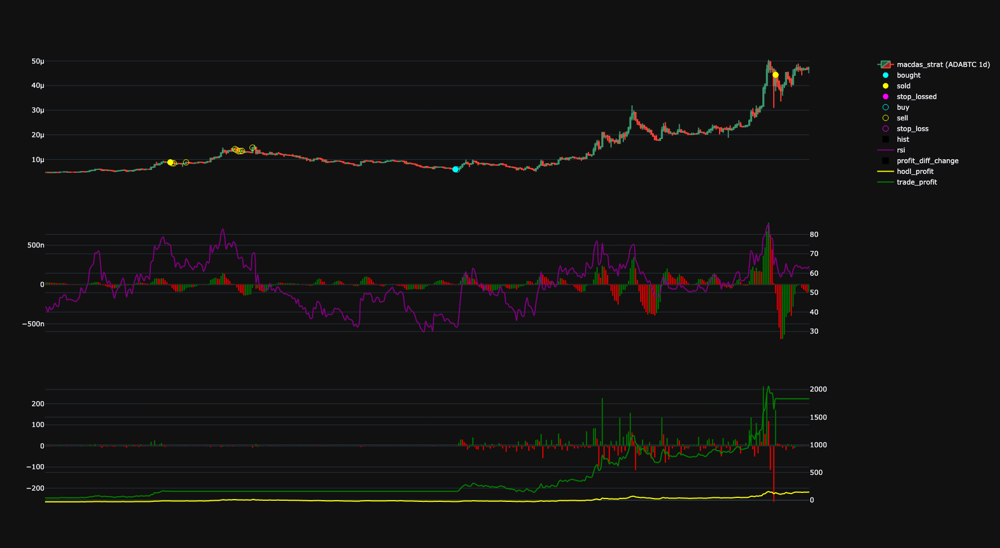

Yuzu is an open source crypto trading bot written in Python. It features exchange specific backtesting, custom strategy integration, adaptive strategy optimization, adaptive graph plotting, paper trading, and soon will feature live trading.

# Features

- [x] **create custom strategies** _(add your own strategy functions)_

- [x] **adaptive graph plot** _(templated graphing function)_
  
- [x] **optimize strategies** _(optimize strategy parameters using a genetic algorithm)_
- [ ] **package project** _(install using PyPI to code with YUZU)_
- [ ] **cli** _(command-line interface to use YUZU)_
- [ ] **ui** _(React-based user interface to use YUZU)_

## Exchange Support

- [x] **PaperWallet** _(used by any exchange to paper trade)_
- [ ] **BinanceUS**
  - [x] **historical data** _(pull data to backtest)_
  - [ ] **live trading** _(create websocket to start live trading)_
  - [ ] **user info** _(pull user account information)_
- [ ] **CoinbasePro**
  - [ ] **historical data** _(pull data to backtest)_
  - [ ] **live trading** _(create websocket to start live trading)_
  - [ ] **user info** _(pull user account information)_
- [ ] **Kraken**
  - [ ] **historical data** _(pull data to backtest)_
  - [ ] **live trading** _(create websocket to start live trading)_
  - [ ] **user info** _(pull user account information)_

# Usage

## How to [Create a Custom Strategy](./assets/custom-strategy.md)

## How to [Optimize Strategy Parameters](./assets/optimize-strategy.md)
